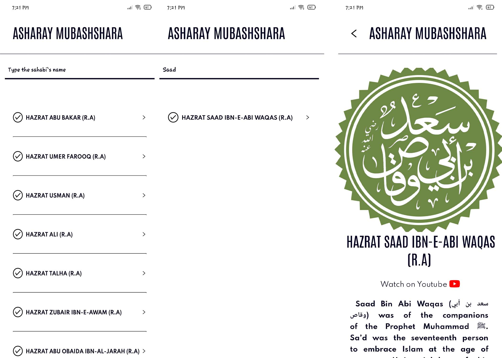

# 10jannatisahabi

* Clone this repository and command npm install
* After installation, command expo start (need to install expo on your machine)
* Scan the QR code from terminal by your phone through EXPO go apps which you can found on Play Store
* BOOM!!

## Eas Build
* https://expo.dev/accounts/mahir250/projects/10jannatisahabi/builds/219ef8bc-8529-4197-9960-932aec32c12c

